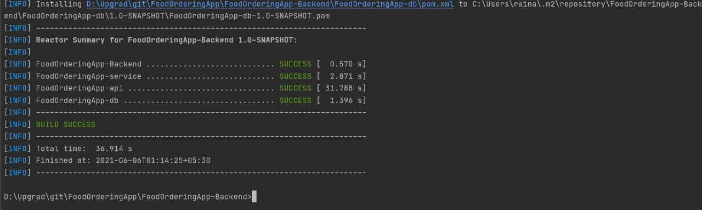
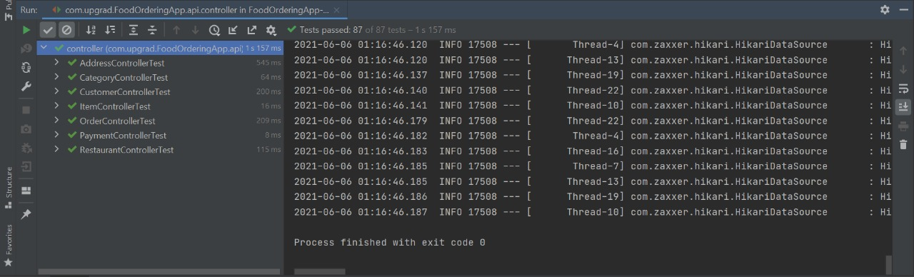
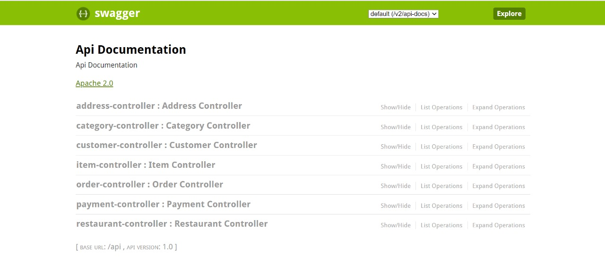

# FoodOrdering App-Backend
> *Capstone project Food Ordering App Backend*
> 
>  **Food Ordering App** is a web application,  which is created with the basic idea to allow a customer browse restaurants and order menu items from that restaurant.

# Pre-requisite
* Create a database in your Postgres named ***restaurantdb***.
* Update the database configuration information in **localhost.properties** and **application.yaml** file.
 > * For **application.yaml** file:  
   ``
     spring.datasource.url= jdbc:postgresql://localhost:<port>/restaurantdb 
    spring.datasource.customername=<username>
    spring.datasource.password=<password> ``
  
 > * For **localhost.properties** file:
    ``server.port=<port>
    server.host=localhost
    database.name=restaurantdb
    database.customer=<username>
    database.password=<password>
 > ``
  
* Complile the project with following command ``mvn clean install -Psetup``  
*If above config is correct you should see below success build and success for unit testcase.*
  
  

* Run the application and use Swagger UI to check the end-point with following link
  ``localhost:8080/api/swagger-ui.html``
  It should load below page.
  
  
